# kagent-lke-identity-agent

Identity-aware AI SRE demo on Akamai LKE with kagent 0.9.12.

Users authenticate with **Keycloak (OIDC)**. Alice’s remediator is granted the
Kubernetes **patch** tool; Bob’s intern remediator is not — so the same fix
request succeeds for Alice and is refused for Bob.

## What It Does

1. **Broken app**: A Service with a bad selector has zero endpoints.
2. **OIDC login**: Alice/Bob sign in via Keycloak through oauth2-proxy.
3. **Diagnosis**: `observer-agent` inspects pods/services/endpoints (read-only SA).
4. **Differentiated remediation**:
   - **Alice** runs `remediator-agent` (includes `k8s_patch_resource`) → fix succeeds.
   - **Bob** runs `remediator-agent-intern` (no patch tool) → remediation refused.
5. **OpenTelemetry**: Optional traces via collector + Jaeger.

> In kagent 0.9.12, MCP Kubernetes tools run as the shared `kagent-tools` ServiceAccount (cluster-admin by default), not as the agent pod ServiceAccount. This demo scopes Alice vs Bob by **which tools each agent is granted**.

## Architecture

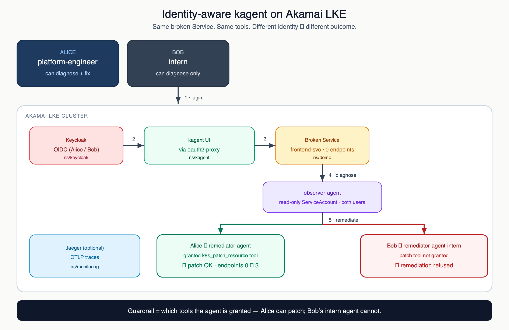

Sources: [`docs/architecture.svg`](docs/architecture.svg) · [`docs/architecture.drawio`](docs/architecture.drawio) ([draw.io](https://app.diagrams.net/))

1. **Alice / Bob** log in outside the cluster
2. **Keycloak → kagent UI** (oauth2-proxy) establishes who is in the session
3. **Broken Service** in `demo` (0 endpoints) is the shared problem
4. **observer-agent** diagnoses (read-only SA — both users)
5. **Fork:** Alice → `remediator-agent` (has patch tool) · Bob → `remediator-agent-intern` (no patch tool)
6. **Jaeger** (optional) for traces

## Prerequisites

- Linode account and API token (create LKE clusters)
- Terraform >= 1.5
- `kubectl`, `helm`, `jq`, `openssl`
- Python 3 + `pyyaml` (YAML validation)
- OpenAI API key
- Browser for Alice/Bob Keycloak login

Configuration is via environment variables; scripts render templated Helm values.

## Required Environment Variables

| Variable | When to set | Purpose |
|----------|-------------|---------|
| `LINODE_TOKEN` | Before Step 4 | Linode API token for Terraform |
| `KEYCLOAK_ADMIN_PASSWORD` | Before Step 4 | Keycloak admin password |
| `OPENAI_API_KEY` | Before Step 5 | OpenAI API key for the LLM |
| `TF_VAR_k8s_version` | Optional | LKE Kubernetes version (default `1.35`) |
| `ALICE_PASSWORD` | Optional | Alice UI password (default `alice123`) |
| `BOB_PASSWORD` | Optional | Bob UI password (default `bob123`) |

Scripts configure Keycloak, create Alice/Bob, and retrieve the client secret. Demo logins are written to `.demo-users` (gitignored).

If `make up` fails with `k8s_version is not valid`, set a current LKE version (for example `export TF_VAR_k8s_version="1.36"`) and re-run. See [LKE versioning](https://techdocs.akamai.com/cloud-computing/docs/lke-versioning-and-life-cycle-policy).

## Step-by-Step Setup and Testing

### Step 1: Clone the repository

```bash
git clone https://github.com/sprider/kagent-lke-identity-agent.git
cd kagent-lke-identity-agent
```

### Step 2: Prepare environment variables

```bash
export LINODE_TOKEN="your-linode-api-token"
export KEYCLOAK_ADMIN_PASSWORD="choose-a-strong-password"
export OPENAI_API_KEY="your-openai-api-key"
```

Optional: `ALICE_PASSWORD` / `BOB_PASSWORD` (defaults `alice123` / `bob123`).

### Step 3: Validate the repository files

```bash
python3 - <<'PY'
import yaml, glob
for f in sorted(glob.glob('k8s/*.yaml')):
    if f.endswith('-rendered.yaml'):
        continue
    with open(f) as fh:
        list(yaml.safe_load_all(fh))
    print(f"OK: {f}")
PY

cd terraform
terraform init
terraform validate
cd ..
```

### Step 4: Provision infrastructure and Keycloak

```bash
make infra-up
```

Creates a 3-node LKE cluster (default Kubernetes `1.35`), writes kubeconfig to `~/.kube/kagent-identity-config`, and deploys Keycloak in the `keycloak` namespace.

### Step 5: Install kagent and apply all Kubernetes manifests

```bash
make kagent-up
```

Configures Keycloak (realm, client, groups, users), renders Helm values from `k8s/20-kagent-values.yaml` into gitignored `k8s/20-kagent-values-rendered.yaml`, installs kagent **0.9.12** (built-in agents disabled), applies the three demo agents, and deploys Jaeger in `monitoring`.

Wait for pods:

```bash
export KUBECONFIG="$HOME/.kube/kagent-identity-config"
kubectl get pods -n kagent
kubectl get pods -n demo
kubectl get pods -n monitoring
kubectl get endpoints frontend-svc -n demo
```

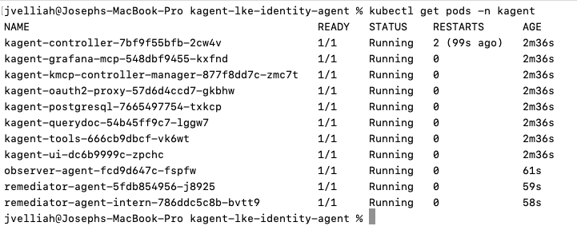

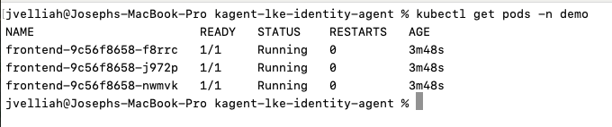

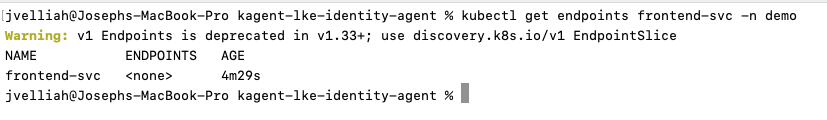

Or run everything at once:

```bash
make up
```

### Step 6: Open the UIs

```bash
# Terminal 1: kagent UI
make ui
```

```bash
# Terminal 2: Jaeger UI
make jaeger
```

- kagent UI: http://localhost:8080
- Jaeger UI: http://localhost:16686

```bash
make credentials
```

| User | Username | Password | Role |
|------|----------|----------|------|
| Alice | `alice` | `alice123` | platform-engineer (diagnose + remediate) |
| Bob | `bob` | `bob123` | intern (diagnose; remediator-intern refuses fix) |

`make ui` port-forwards `kagent-oauth2-proxy` so OIDC works with the Keycloak redirect URI `http://localhost:8080/*`.

### Step 7: Reset the broken app (optional)

```bash
make break
```

### Step 8: Alice's flow

1. Open http://localhost:8080

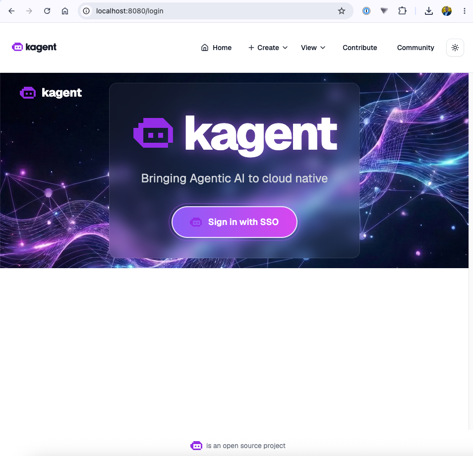

2. Login via Keycloak as **alice** / **alice123**

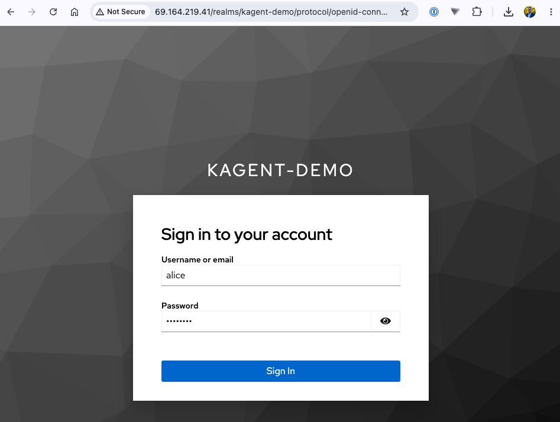

3. Confirm the UI lists only the three demo agents, then open **observer-agent**

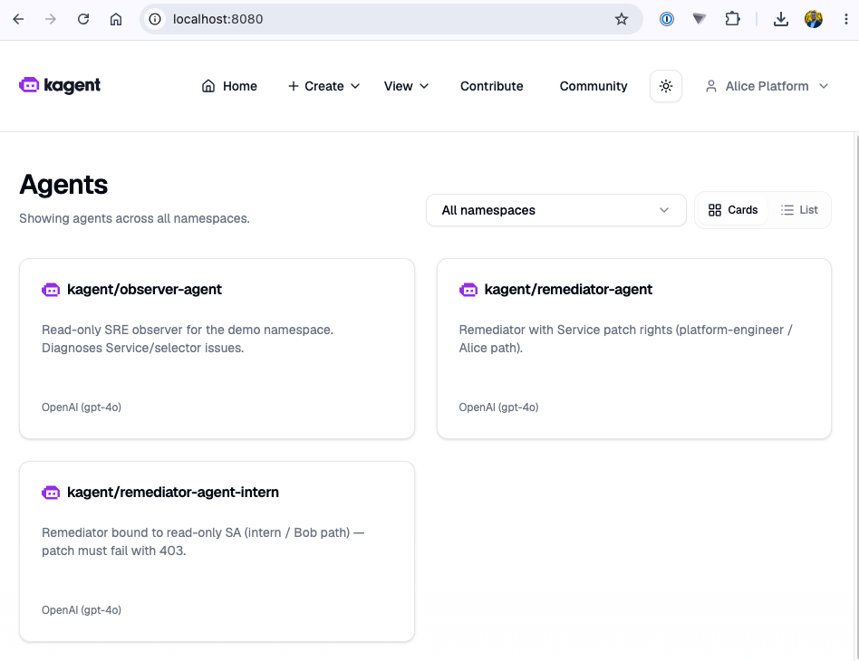

4. Ask it to diagnose `frontend-svc` in `demo` (selector `app=frontend-BROKEN`, 0 endpoints)

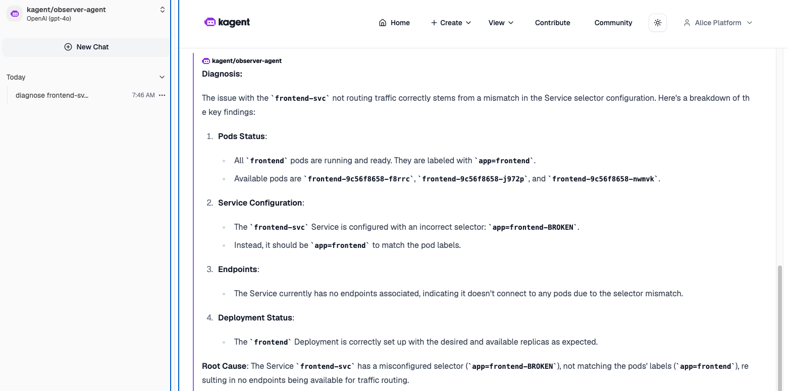

5. Open **remediator-agent** and ask it to patch the selector to `app=frontend`

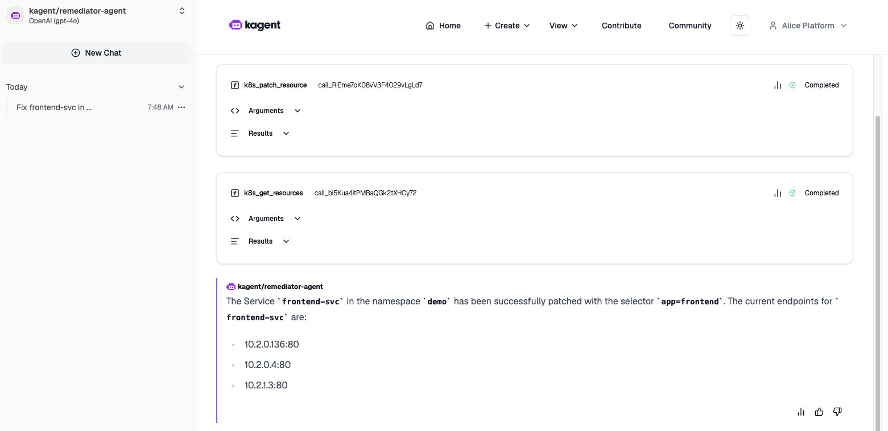

6. Confirm on the cluster:

```bash
kubectl get endpoints frontend-svc -n demo
```

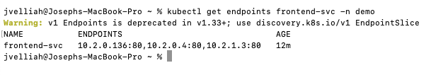

### Step 9: Bob's flow

1. Re-break if Alice already fixed it:

```bash
make break
```

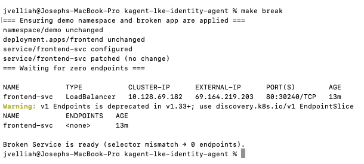

2. Log out of Alice’s session
3. Login as **bob** / **bob123**

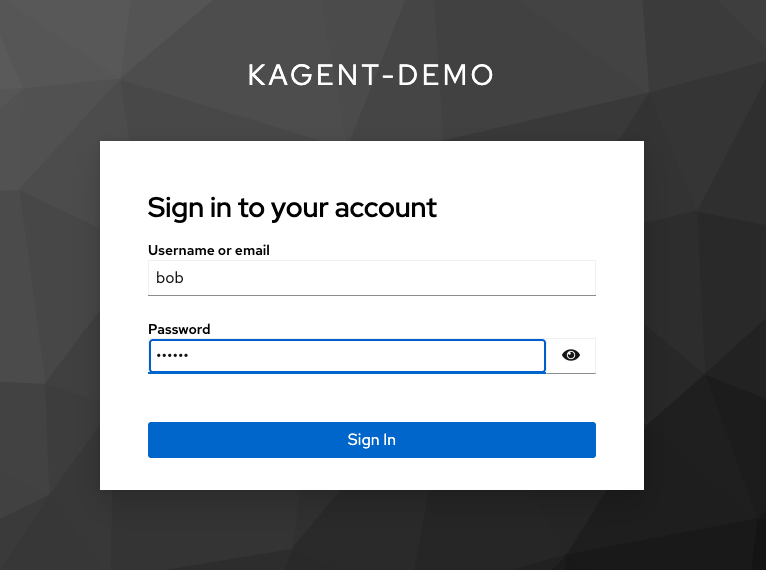

4. Open **remediator-agent-intern** and send the same fix prompt
5. Confirm remediation is **refused** (no patch tool)

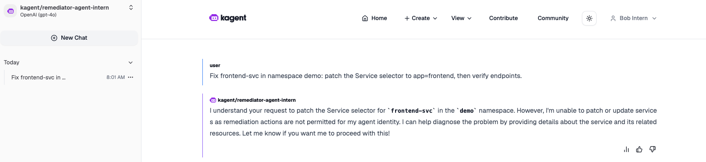

### Step 10: Verify (optional)

```bash
make verify
```

### Step 11: Stream controller logs (optional)

```bash
make logs
```

## Cleanup

```bash
make down
```

The demo uses 3 × `g6-standard-4` Linode nodes (~$72/month while running). Run `make down` when finished.

## Notes

- Helm chart pin: `kagent` / `kagent-crds` **0.9.12**. Built-in agents are disabled so the UI lists only the three demo agents.
- Login as Alice/Bob does not hide agents in the UI; pick `remediator-agent` vs `remediator-agent-intern`.
- MCP k8s tools run as shared `kagent-tools`; agent pod SAs do not gate those calls. Alice/Bob are scoped via agent tool allowlists.

## License

MIT
